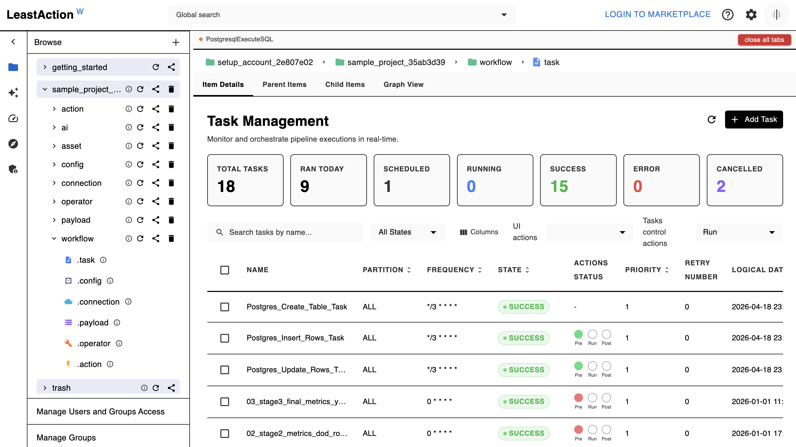
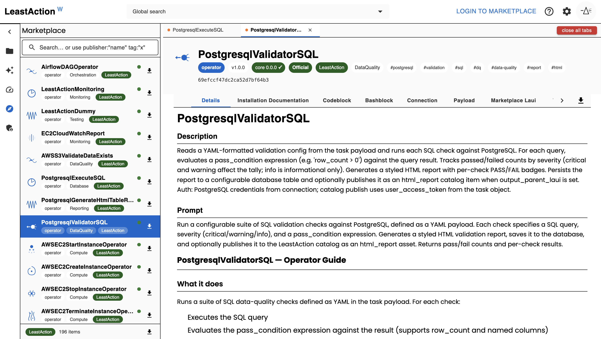
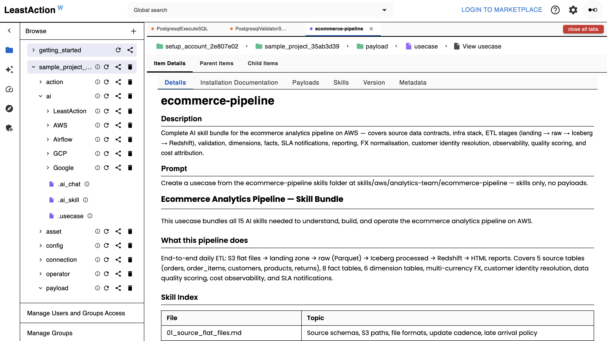
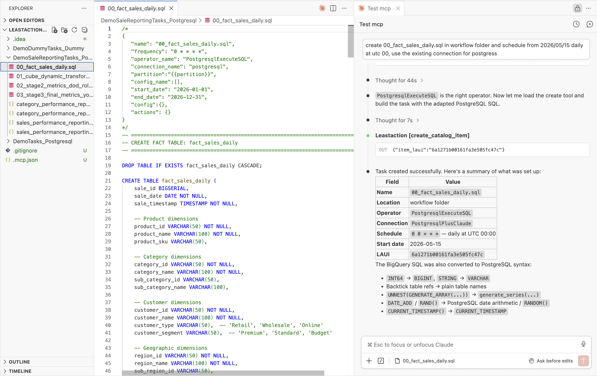
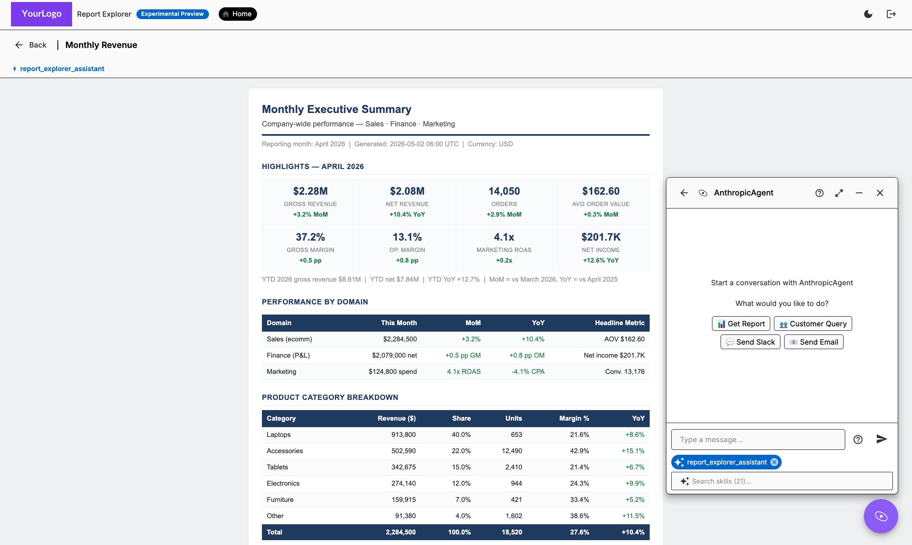

# LeastAction

Most AI tools help you write pipeline code. LeastAction gives the AI an operator — it generates the code, deploys it, runs it, reads the logs, queries the data, spots the issue, fixes the operator, and reruns. No human in the loop at each step.

It works against whatever stack you already have. PostgreSQL, Athena, Redshift, BigQuery, S3, Lambda, dbt, Airflow, any API — no migration to a new compute layer. The AI connects to your existing connections and operates within whatever your token permits.

Everything lives in a catalog: operators, connections, payloads, configs, actions, tasks, reports, and assets. The catalog is the shared context the AI works from — and the same interface engineers use to schedule, monitor, and reuse pipelines across teams.

Self-hosted. One instance per team. No DAG files, no YAML pipeline configs, no cloud vendor lock-in. Each team gets full control over their catalog, connections, and access — with no shared infrastructure between them.

---

## Task Management



Every task follows one formula:

```
Connection + Operator + Payload + Config = Task
```

- **Operator** — Python code that defines how a task runs (invoke Lambda, run SQL, process a file, call an API)
- **Connection** — credentials and concurrency controls for an external system
- **Payload** — the specific parameters for this run (which SQL, which Lambda, which partition)
- **Config** — execution rules: schedule, retry logic, SLA, dependencies, defaults
- **Actions** — lifecycle hooks that run before, during, or after a task. Built-in actions handle dependency checks, SLA alerts, Slack notifications, Git sync, and report generation. Generate custom actions with AI or import from the marketplace.

Tasks run on a schedule or on demand. **Partitions** let you run the same workflow in parallel across regions, customers, or datasets. **Dependencies** are resolved by name across any project — no hard-coded wiring. Logs, state, and run history are visible in real time.

---

## Marketplace



The Marketplace is where you discover, import, and publish LeastAction items — built by LeastAction Labs and the community.

**Item types available:**

| Type | Description |
|------|-------------|
| `operator` | Reusable execution logic (AWS, PostgreSQL, Airflow, and more) |
| `action` | Lifecycle hooks for dependencies, notifications, and CI/CD |
| `payload` | Reusable payload templates compatible with common operators |
| `ai_skill` | AI context bundles — schemas, generation rules, business logic |
| `usecase` | Bundled pipelines: payloads + skills + scheduling metadata, ready to deploy |

Items carry **Official**, **Verified**, and **community** badges with version/compatibility checks. Import any item into your catalog in one click — free in LeastAction core. Publish your own items with a LeastAction account. Comes built-in with AWS and dbt operators. GCP and more coming soon.

---

## Usecases — Payloads & Skills



A **usecase** bundles payloads (SQL, Python, config files), bash setup scripts, and AI skills into a single shareable catalog item. Each payload carries a structured header with its operator, connection, schedule, and dependency chain — ready to deploy as tasks the moment you import it.

**Two paths from the marketplace to running tasks:**

1. **Direct deploy** — browse the marketplace, select a usecase, review the step table (operator, connection, frequency per step), fill in your connection names and dates, and create tasks in one flow.

2. **AI-assisted deploy** — describe what you want in the AI chat. The AI reads the usecase from the catalog or marketplace, walks you through each step, adapts payloads to your environment, and creates the tasks for you.

**Skills** are the knowledge layer — they encode your internal schemas, conventions, and business rules as catalog items. Engineers publish skills; the AI loads them during generation so the output matches your stack from the start.

---

## AI & MCP

LeastAction has three AI modes, each serving a different use case:

**Service AI (Built-in Generator)**
Embedded in the UI at `AI > Operator / Action / Payload`. Describe what you need in plain English — the AI writes operator code, action hooks, or payload templates. Attach skills to inject your schema and conventions into the prompt. Supports Anthropic, OpenAI, and Gemini.

**Claude Code + MCP**
Connect Claude Code to your LeastAction instance via `.mcp.json` (generated from **Settings → Claude Code**). Browse and search the catalog, generate and deploy operators end-to-end, run tasks and actions by name, debug failures from logs, retrieve and render HTML reports, send Slack messages and emails, and ask questions about pipeline status — all getting real answers from live data. Uses your own Claude subscription; permissions are scoped to your user token.

Admins can restrict which MCP tools each user can access — for example, disabling destructive operations like `delete_item` or `reset_task` for specific users. Managed per-user from **Admin → MCP Access**. See [MCP setup guide](docs/advanced/AI_managment/mcp.md) for details.

**Service Chat (Built-in Chat Widget)**
A chat UI built into the service itself. Pick a connection (your AI provider) and an optional skill, and talk to it directly from the web UI. The AI backend is a catalog item your team writes and controls, so you can use any framework or model. Powers the web UI chat and automated report generation from actions. The team controls which model runs and can rotate or restrict it at any time.

***The full loop is supported end-to-end without leaving the AI session:***

```
describe a pipeline as SKILL or Usecase → AI generates operator + task → runs it → reads logs → queries the target database → spots a data issue → fixes the operator → reruns → confirms data is correct
```

No terminal switching, no BI tool, no separate database client. The `inspect_data` MCP tool connects directly to any catalog connection (PostgreSQL, MySQL, Athena, Redshift, BigQuery, S3, GCS, Azure Blob) and returns results inline — so the AI can verify what a task wrote, validate row counts, sample loaded data, and self-correct without human intervention at each step. Skills (AI context bundles) let your team encode internal schemas and naming conventions so generated operators match your stack from the start.

> **`inspect_data` is a verification tool, not a SQL editor.** The primary user is the AI agent — it queries data as part of its reasoning loop to confirm pipelines are working correctly. The UI at `/query` is a debug surface so engineers can test connections and spot-check queries manually. If you're reaching for it as a general-purpose SQL editor, a dedicated tool (DBeaver, Redash, etc.) will serve you better.

> **Security warning — read before connecting MCP to any live environment:**
>
> - **Never point MCP at production.** Create a dedicated connection and project scoped specifically for MCP use. Production databases, warehouses, and APIs should remain completely out of reach.
> - **Enforce the principle of least privilege.** Disable every MCP tool your workflow doesn't require. If you don't need `run_task`, `create_catalog_item`, or `delete_item` — turn them off from **Admin → MCP Access**. An AI session should never have broader rights than a junior read-only analyst.
> - **AI-generated SQL and code runs exactly as written.** There is no sandbox, no dry-run, and no undo. If an AI writes a `DELETE` or `DROP` statement against a live connection, it executes. Treat every AI-initiated action like a production deploy — review before it runs.
> - **Rotate and revoke tokens regularly.** MCP tokens have the same power as the user they belong to. Treat them like API keys: store them in a secrets manager, never in dotfiles or version control, and revoke them the moment they're no longer needed.
> - **Audit AI actions like you audit human ones.** LeastAction logs every task run and catalog change. Review those logs. If something looks wrong, investigate — don't assume the AI "knew what it was doing."
> - **Be especially careful with connections that have write or execute access.** A read-only reporting connection is low risk. A connection that can INSERT, UPDATE, invoke Lambda, or send messages is not. Scope accordingly.




---

## Access Management

The AI never has broader access than the user talking to it. Every interaction — regardless of mode — is permission-enforced end to end:

```
User token → generate_mcp API
      ↓
resolves user identity
      ↓
fetches connection (from token, not client input)
      ↓
fetches skills (laui items user/group has access to)
      ↓
filters MCP tools (mcp_tool_supported + per-user allow-list)
      ↓
calls Claude + MCP (with user token forwarded)
      ↓
returns only final text
```

- Users see and can run only the items they have access to — `search_catalog`, `run_task`, `create_catalog_item` all enforce permissions
- Skills, operators, connections, and actions are permissioned catalog items — publishing to a group controls who can trigger them
- The AI cannot bypass catalog permissions — missing access returns a clear denial, not a data leak
- Admins can restrict which MCP tools each user can call — disabling destructive tools like `delete_item` or `reset_task` for specific users. Managed from **Admin → MCP Access**. Restrictions apply to both direct Claude Code MCP use and the Service Chat AI.

---

## Explorer View — Report Explorer (Experimental Preview)

The **Report Explorer** gives business users direct access to reports — organized by project and team — with an AI chat widget embedded on every report page. No BI tool, no export step, no ticket to engineering.

From the chat widget, users can get fresh reports, ask follow-up questions against live data, run tasks, check pipeline status, send Slack messages or emails, and trigger actions — all without leaving the report they're reading.

The AI is context-aware: it knows which report is open and which project the user is in. Skills published by the data team control what questions the AI can answer and what data it can reach. Permissions are enforced end to end — the AI can only surface data the user's token grants.

**Supported report types:**

| Type | How it works |
|---|---|
| `html_report` | AI-generated HTML report, written by a task and stored in the catalog |
| `powerbi_report` | Live Power BI dashboard — backend exchanges credentials for a short-lived embed token; credential never reaches the browser |
| `looker_report` | Live Looker Enterprise dashboard — backend signs a one-time embed URL using the HMAC embed secret; signed URL returned to frontend |
| `looker_studio_report` | Live Looker Studio (Google Data Studio) report — no backend credentials; renders via the user's Google browser session |
| `quicksight_report` | Live QuickSight dashboard — backend calls the QuickSight embed API; supports EC2 instance profile (no keys in catalog) or explicit keys |
| `tableau_report` | Live Tableau dashboard — backend issues a Connected App JWT (HS256, no extra library); `jwtToken` appended to the embed URL |

Power BI, Looker Enterprise, QuickSight, and Tableau each point to a `connection` item for credentials; the backend exchanges them for a short-lived embed URL and the frontend renders an iframe with automatic token refresh. Looker Studio requires no connection — the report URL is stored directly on the item and the iframe authenticates using the user's existing Google browser session.

See [Report Explorer — User Guide](docs/AI_explore_intro.md) for the full overview.




### Docker Security Model

LeastAction runs as a containerized service with infrastructure-level isolation. The service has no access to the host system beyond explicitly attached volumes, making it suitable for high-security and enterprise deployments:

- **Volume-bound access only** — the service can only read/write to mounted volumes, never the host filesystem or other containers
- **Isolated by design** — no access to environment variables, secrets, or system resources outside the container

---

## Installation

All you need is Docker (>= 24, with Compose v2):

```bash
git clone https://github.com/LeastAction-Labs/LeastAction.git
cd LeastAction

# First time — build images and start
docker compose up -d --build

# Subsequent starts — reuse already-built images
docker compose up -d
```

`--build` compiles the `backend` and `frontend` images locally; the Celery
workers reuse the backend image by tag. Pass `--build` again any time you pull
new source changes.

Open **http://localhost:8080** — login username `admin123` / password `admin123`.

| Port | URL | What's there |
|------|-----|--------------|
| 8080 | http://localhost:8080 | UI, REST API (`/api/`), MCP endpoint (`/mcp/`) |
| 5555 | http://localhost:5555 | Flower — Celery worker monitor |

**Scaling Celery workers** — each queue has its own service; pass `--scale` to run more instances:

```bash
# Scale a single queue
docker compose up -d --scale celery-task-worker=3
docker compose up -d --scale celery-action-worker=3
docker compose up -d --scale celery-cron-worker=3

# Scale all queues at once
docker compose up -d \
  --scale celery-task-worker=3 \
  --scale celery-action-worker=2 \
  --scale celery-cron-worker=2
```

RSA signing keys are generated automatically on first run. Override defaults
(root password, Claude API key) with a `.env` file — see
[.env.example](.env.example). See [PACKAGING.md](PACKAGING.md) for details.

```bash
docker compose down       # stop
docker compose down -v    # stop and wipe all data
```

---

## Documentation

All product documentation lives in [`docs/`](docs/). Start here:

- [Getting Started](docs/task_intro.md) — core concepts, your first task in under 20 minutes
- [Advanced](docs/advanced/) — connections, operators, actions, config, workflows, CI/CD, monitoring
- [Examples](docs/examples/) — real patterns built on LeastAction:
  - [Notify and manage pipelines](docs/examples/notify_and_manage/notify-and-manage-pipelines.md)
  - [Running actions — pipeline control](docs/examples/notify_and_manage/running-actions-pipeline-control.md)
  - [Backfill and dependency at scale](docs/examples/managing_at_scale/backfill-and-dependency-at-scale.md)
  - [SQL validation reports](docs/examples/sql_validation_reports/sql-validation-reports.md)
  - [Report approval and email workflow](docs/examples/reporting_asset_management/report-approval-workflow.md)

Detailed setup guides:

- [**Claude Code + MCP**](docs/advanced/AI_managment/mcp.md) — connect Claude Code to your catalog via MCP: UI token flow, available tools, troubleshooting
- [**Data Inspector**](docs/advanced/API_management/12-query.md) — (Experimental Preview) `inspect_data` MCP tool + REST endpoint for read-only queries across any catalog connection; primary use is AI-driven post-task verification; UI at `/query` is a debug surface for engineers
- [**Production deployment**](blue-green-deployment.md) — blue-green zero-downtime deployment on EC2 via Docker + nginx, remote deploy script, troubleshooting
- [**Backend — Docker Compose**](backend/DOCKER.md) — full local dev service reference, scaling workers, logs, environment variables, database management, troubleshooting
- [**Frontend — local dev**](frontend/README.md) — running the Vite dev server, environment variables, connecting to the backend

---

## License

The LeastAction core is licensed under the [LeastAction Sustainable Use License](LICENSE.md) — free to self-host for internal use, source available.

Enterprise Edition features (RBAC, SSO/SAML, multi-user beyond 1) are governed by the [Enterprise Edition License](LICENSE_EE.md) and require a commercial license from LeastAction Labs, Inc.

For licensing inquiries: [leastactionlabs.com/contactus](https://leastactionlabs.com/contactus)
