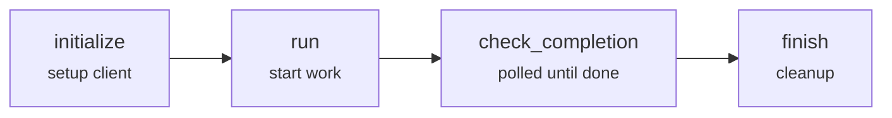

# LeastAction Operator - Feature Guide

## Overview

An **operator** in LeastAction is executable code that defines how tasks interact with external systems and perform work. Operators are the execution engines that process payloads using connection configurations. They are **first-class items** that can be created via UI, generated by AI, shared in marketplaces, and auto linked to tasks on creation.

### What is an Operator?

An operator is self-contained code with a standardized four-function structure:

- **`initialize()`** - Set up resources, authenticate, create clients
- **`run()`** - Execute the task's payload and start the operation
- **`check_completion()`** - Monitor execution status (for async operations)
- **`finish()`** - Clean up resources after completion

**Key Characteristics:**

- **Multi-Phase Execution**: Supports complex, long-running operations with status polling
- **Asynchronous Support**: Can handle operations that take minutes or hours
- **State Management**: Maintains execution state across phases
- **Resource Lifecycle**: Proper initialization and cleanup
- **Type Safety**: Optionally enforced via `enforce_connection_operator_mapping` in `system.yml`

### Operator vs Payload vs Task

```
Operator: The "HOW" - Execution logic and integration code
↓
Connection: The "WHERE" - Resources, credentials, limits
↓
Payload: The "WHAT" - Specific parameters and data
↓
Task: The "INSTANCE" - Combining all above for execution
```

**Example:**

- **Operator**: `operator.AWSIAMRole` (knows HOW to invoke AWS services - Lambda, S3, EC2, etc.)
- **Connection**: `lambda-prod` (WHERE: AWS credentials, region - type `connection.AWSIAMRole`)
- **Payload**: `{function_name: "process-events", date: "2024-01-15"}` (WHAT to do)
- **Task**: `process_daily_events` (specific execution instance)

### When to Use Operators vs Actions

| Feature | Operator | Action |
|---------|----------|--------|
| **Execution Model** | Asynchronous with polling | Synchronous, immediate |
| **Methods** | 4 methods (init, run, check, finish) | 1 method (run) only |
| **Return Type** | Dict with status/message/output | Boolean (True/False) |
| **Duration** | Long-running (minutes-hours) | Quick (seconds) |
| **Use Cases** | Resource management, batch jobs | Notifications, validations |

**Use Operator for:**

- ✅ Starting cloud resources (EC2, RDS)
- ✅ Running batch data processing
- ✅ Executing remote commands
- ✅ Operations requiring status polling
- ✅ Multi-step deployments

**Use Action for:**

- ✅ Sending notifications (Slack, email)
- ✅ Simple API calls with immediate response
- ✅ Data validation/transformation
- ✅ Checking dependencies (checkIfParentsAreDone)

## Operator Structure

### JSON Format

```json
{
  "bashblock": {
    "main.sh": "pip install boto3"
  },
  "codeblock": {
    "main.py": "Python code with 4 required functions"
  },
  "payload": {
    "function_name": "my-lambda",
    "invoke_payload": {}
  },
  "connection": {
    "region": "us-east-1",
    "aws_access_key_id": "..."
  },
  "item_type": "operator.AWSIAMRole"
}
```

**Components:**

- **`bashblock`**: Shell commands for installing dependencies
- **`codeblock`**: Python code containing all 4 operator methods
- **`payload`**: Operation-specific parameters (example/template)
- **`connection`**: Credentials and configuration (example/template)
- **`item_type`**: Format is `operator.{subtype}` (e.g., `operator.AWSIAMRole`). Subtype is optional — use `operator` if no subtype is needed.

**Note on Operator-Connection Compatibility:** Subtype matching is optional. When `enforce_connection_operator_mapping: true` is set in `system.yml`, the system validates that the operator subtype is allowed for the selected connection subtype (e.g., `operator.AWSIAMRole` with `connection.AWSIAMRole`). With enforcement off, any operator can pair with any connection.

### Single vs Multi-File Operators

#### Single-File Operators

Standard structure with code in a single `main.py` file:

```json
{
  "codeblock": {
    "main.py": "All 4 methods in one file"
  }
}
```

#### Multi-File Operators

For complex operators, split code across multiple files. **Required constraint: `main.py` must exist and contain all 4 required methods** (initialize, run, check_completion, finish).

```json
{
  "codeblock": {
    "main.py": "Contains all 4 required methods",
    "utils.py": "Helper functions",
    "helpers/database.py": "Database utilities"
  }
}
```

**Multi-File Structure Rules:**

- **`main.py` is mandatory** - Must contain all 4 functions: `initialize()`, `run()`, `check_completion()`, `finish()`
- **Additional files are optional** - Create helper modules for code organization
- **All files are in same directory context** - Use relative imports (e.g., `from utils import helper_func`)
- **Path structure is preserved** - Subdirectories like `helpers/` are supported

**Example Multi-File Operator:**

```json
{
  "codeblock": {
    "main.py": "import json\nfrom aws_client import AWSClient\n\ndef initialize(...):\n    return AWSClient(...)\n\ndef run(...):\n    ...\n\ndef check_completion(...):\n    ...\n\ndef finish(...):\n    ...",
    "aws_client.py": "class AWSClient:\n    def __init__(self, credentials):\n        ...",
    "utils/validators.py": "def validate_payload(payload):\n    ..."
  }
}
```

**When to Use Multi-File:**

- ✅ Operator code exceeds 500 lines
- ✅ Reusing utility functions across multiple operators
- ✅ Complex connection/client logic deserves separate module
- ✅ Team wants cleaner code organization

### The Four Required Functions



## The Four Methods

### 1. initialize()

**Purpose**: Set up connections, authenticate, and return a client object

```python
def initialize(least_action_task_object):
    """
    Initialize connections and return a client object.

    Parameters:
        least_action_task_object (dict): Task context with connection, payload

    Returns:
        any: Client/connection object (boto3 client, DB connection, etc.)
    """
```

**Responsibilities:**

- Extract credentials from `connection` object
- Create and configure client/connection objects
- Verify connectivity (recommended)
- Handle authentication errors
- Return initialized client for use in other methods

**Example:**

```python
def initialize(least_action_task_object):
    connection = least_action_task_object.get('connection', {})

    try:
        log_info("task", "initialize", "creating_client",
                 "Setting up AWS Lambda client")

        if connection.get('aws_access_key_id'):
            client = boto3.client(
                'lambda',
                region_name=connection.get('region', 'us-east-1'),
                aws_access_key_id=connection['aws_access_key_id'],
                aws_secret_access_key=connection['aws_secret_access_key']
            )
        else:
            client = boto3.client(
                'lambda',
                region_name=connection.get('region', 'us-east-1')
            )

        # Verify connection
        client.list_functions(MaxItems=1)
        log_info("task", "initialize", "connection_verified",
                 "Successfully connected to AWS Lambda")

        return client

    except Exception as e:
        log_error("task", "initialize", "error",
                  f"Failed to initialize: {str(e)}")
        raise
```

### 2. run()

**Purpose**: Start the operation and return execution details

```python
def run(least_action_task_object, client):
    """
    Execute the operation and return details.

    Parameters:
        least_action_task_object (dict): Task context object
        client (any): Client object returned from initialize()

    Returns:
        dict: Must contain 'execution_type' and operation details
            {
                'execution_type': 'async' or 'sync',
                'operation_id': 'unique-operation-identifier',
                # ... other operation-specific fields
            }
    """
```

**Responsibilities:**

- Parse payload from `least_action_task_object`
- Validate input parameters
- Start the operation using the client
- Return execution details needed by `check_completion()`

**Required Return Fields:**

- `execution_type`: **REQUIRED** - Must be `'async'` or `'sync'`
- Additional fields: Operation identifiers, resource IDs, etc.

**Example:**

```python
def run(least_action_task_object, client):
    payload = least_action_task_object.get('payload', '{}')

    try:
        log_info("task", "run", "parsing_payload",
                 "Parsing payload for Lambda invocation")

        # Parse payload (can be string or dict)
        if isinstance(payload, str):
            payload_data = json.loads(payload)
        else:
            payload_data = payload

        function_name = payload_data.get('function_name')
        invoke_payload = payload_data.get('invoke_payload', {})
        invocation_type = payload_data.get('invocation_type', 'RequestResponse')

        if not function_name:
            raise ValueError("function_name is required")

        log_info("task", "run", "invoking_lambda",
                 f"Invoking Lambda: {function_name}")

        response = client.invoke(
            FunctionName=function_name,
            InvocationType=invocation_type,
            Payload=json.dumps(invoke_payload)
        )

        response_payload = json.loads(response['Payload'].read().decode('utf-8'))

        log_info("task", "run", "lambda_invoked",
                 "Lambda invoked successfully")

        return {
            'execution_type': 'sync' if invocation_type == 'RequestResponse' else 'async',
            'function_name': function_name,
            'response_payload': response_payload,
            'status_code': response['StatusCode']
        }

    except Exception as e:
        log_error("task", "run", "error",
                  f"Error invoking Lambda: {str(e)}")
        raise
```

### 3. check_completion()

**Purpose**: Check if the operation has completed and return status

```python
def check_completion(least_action_task_object,
                    client, run_details):
    """
    Check operation completion status.

    Parameters:
        least_action_task_object (dict): Task context object
        client (any): Client object from initialize()
        run_details (dict): Dict returned from run() method

    Returns:
        dict: MUST contain 'status', 'message', and 'output'
            {
                'status': 'success' | 'failed' | 'pending',
                'message': 'Human-readable status message',
                'output': {
                    # Result data or error details
                }
            }
    """
```

**Responsibilities:**

- Query operation status using `run_details`
- Determine if operation is complete, failed, or still pending
- Return structured status information

**Required Return Fields:**

- `status`: **REQUIRED** - Must be `'success'`, `'failed'`, or `'pending'`
- `message`: **REQUIRED** - Human-readable description
- `output`: **REQUIRED** - Dict with result data or error details

**Status Values:**

- `'success'`: Operation completed successfully (task finishes)
- `'failed'`: Operation failed (task fails, will retry if configured)
- `'pending'`: Operation still in progress (will poll again)

**Example:**

```python
def check_completion(least_action_task_object,
                    client, run_details):
    try:
        # For synchronous operations
        if run_details.get('execution_type') == 'sync':
            return {
                'status': 'success',
                'message': 'Synchronous Lambda invocation completed',
                'output': run_details.get('response_payload', {})
            }

        # For asynchronous operations
        function_name = run_details.get('function_name')
        log_info("task", "check_completion", "checking_status",
                 f"Checking status of async Lambda: {function_name}")

        # In real implementation, you'd query actual status
        # This is a simplified example
        return {
            'status': 'success',
            'message': f'Asynchronous Lambda {function_name} completed',
            'output': run_details.get('response_payload', {})
        }

    except Exception as e:
        log_error("task", "check_completion", "error",
                  f"Error checking completion: {str(e)}")
        return {
            'status': 'failed',
            'message': f'Error checking Lambda status: {str(e)}',
            'output': {}
        }
```

### 4. finish()

**Purpose**: Clean up resources and close connections

```python
def finish(least_action_task_object, client, completion_details, run_details):
    """
    Clean up resources after operation completes.

    Parameters:
        least_action_task_object (dict): Task context object
        client (any): Client object from initialize()
        completion_details (dict): Final dict from check_completion()
        run_details (dict): Dict from run() method

    Returns:
        None
    """
```

**Responsibilities:**

- Close connections
- Release resources
- Log final status
- Handle cleanup errors gracefully

**Example:**

```python
def finish(least_action_task_object, client, completion_details, run_details):
    try:
        log_info("task", "finish", "cleaning_up",
                 "Cleaning up Lambda client resources")

        if completion_details.get('status') == 'success':
            log_info("task", "finish", "task_completed",
                     "Lambda invocation completed successfully")
        else:
            log_info("task", "finish", "task_failed",
                     f"Lambda invocation failed: {completion_details.get('message')}")

        log_info("task", "finish", "cleanup_complete",
                 "Resource cleanup completed")

    except Exception as e:
        log_error("task", "finish", "cleanup_error",
                  f"Error during cleanup: {str(e)}")
```

## Understanding least_action_task_object

The `least_action_task_object` contains all context and metadata for operator execution.

**Structure:**

```python
least_action_task_object = {
    "laui": "task-unique-identifier",              # Task ID (string)
    "session_id": "session-unique-identifier",     # Session ID (string)
    "connection": {                                # Connection credentials (dict)
        "region": "us-east-1",
        "aws_access_key_id": "...",
        # ... resolved from connection item
    },
    "payload": {                                   # Task payload (dict or JSON string)
        "function_name": "my-lambda",
        "invoke_payload": {},
        # ... operation-specific fields
    },
    "connection_laui": "connection-identifier",    # Connection ID (string)
    "operator_laui": "operator-identifier",        # Operator ID (string)
    "config": {}                                   # Merged config (dict)
}
```

**Safe Field Access:**

```python
# Always use .get() for safe access
task_id = least_action_task_object.get('laui')
session_id = least_action_task_object.get('session_id')
connection = least_action_task_object.get('connection', {})
payload = least_action_task_object.get('payload', '{}')

# Parse payload (can be string or dict)
import json
if isinstance(payload, str):
    payload_data = json.loads(payload)
else:
    payload_data = payload

# Access payload fields with defaults
function_name = payload_data.get('function_name')
timeout = payload_data.get('timeout', 300)
```

## Logging Requirements

Operators use structured logging with **4 parameters only** (no separate task_id/session_id parameters).

**Import:**

```python
from utils.logger import log_info, log_error
```

**Signature:**

```python
log_info(type, function, step, description)
log_error(type, function, step, description)
```

**Parameters:**

- `type`: Always `"task"` for operators
- `function`: Function name (`"initialize"`, `"run"`, `"check_completion"`, `"finish"`)
- `step`: Descriptive step identifier (lowercase with underscores)
- `description`: Detailed message (can include task_id in message string if needed)

**Examples:**

```python
# Correct - 4 parameters
log_info("task", "initialize", "creating_client",
         "Setting up AWS Lambda client")

log_info("task", "run", "invoking_lambda",
         f"Invoking function: {function_name}")

log_error("task", "check_completion", "aws_error",
          f"AWS error: {str(e)}")

# Include context in message if needed
task_id = least_action_task_object.get('laui')
log_info("task", "run", "start",
         f"Starting operation for task: {task_id}")
```

**Step Naming Convention:**

- Use lowercase with underscores
- Be descriptive and consistent

✅ Good: `"creating_client"`, `"parsing_payload"`, `"checking_status"`
❌ Bad: `"Step1"`, `"StartingInstances"`, `"INIT"`

## Error Handling

**Error Handling Strategy:**

| Method | On Error | Reason |
|--------|----------|--------|
| `initialize()` | **Raise** | Fail fast if can't connect |
| `run()` | **Raise** | Fail fast if can't start operation |
| `check_completion()` | **Return failed status** | Allow graceful failure reporting |
| `finish()` | **Log only** | Ensure cleanup always completes |

**Example Patterns:**

```python
# initialize() and run() - RAISE exceptions
def initialize(least_action_task_object):
    try:
        client = create_client(...)
        return client
    except ClientError as e:
        log_error("task", "initialize", "aws_error", f"AWS error: {str(e)}")
        raise  # Re-raise to fail fast
    except Exception as e:
        log_error("task", "initialize", "error", f"Failed: {str(e)}")
        raise

# check_completion() - RETURN failed status
def check_completion(least_action_task_object,
                    client, run_details):
    try:
        # Check status logic
        return {'status': 'success', 'message': '...', 'output': {}}
    except Exception as e:
        log_error("task", "check_completion", "error", f"Error: {str(e)}")
        # Don't raise - return failed status
        return {
            'status': 'failed',
            'message': f'Error checking completion: {str(e)}',
            'output': {}
        }

# finish() - LOG but don't raise
def finish(least_action_task_object, client, completion_details, run_details):
    try:
        # Cleanup logic
        pass
    except Exception as e:
        log_error("task", "finish", "cleanup_error", f"Error: {str(e)}")
        # Don't raise - log and continue
```

## Operator Examples

### Example 1: AWS Lambda Operator

**Type**: `operator.AWSIAMRole`
**Compatible Connections**: `connection.AWSIAMRole` (same extension = compatible)
**Use Cases**: AWS Lambda invocation, S3 operations, EC2 management, Athena queries, serverless function invocation, event processing

**Complete Code:**

```python
# codeblock: main.py
import boto3
import json
from botocore.exceptions import ClientError
from utils.logger import log_info, log_error

def initialize(least_action_task_object):
    connection = least_action_task_object.get('connection', {})

    try:
        log_info("task", "initialize", "creating_client",
                 "Setting up AWS Lambda client")

        if connection.get('aws_access_key_id'):
            client = boto3.client(
                'lambda',
                region_name=connection.get('region', 'us-east-1'),
                aws_access_key_id=connection['aws_access_key_id'],
                aws_secret_access_key=connection['aws_secret_access_key']
            )
        else:
            client = boto3.client('lambda',
                region_name=connection.get('region', 'us-east-1'))

        client.list_functions(MaxItems=1)
        log_info("task", "initialize", "connection_verified",
                 "Successfully connected to AWS Lambda")
        return client

    except Exception as e:
        log_error("task", "initialize", "error", f"Failed: {str(e)}")
        raise

def run(least_action_task_object, client):
    payload = least_action_task_object.get('payload', '{}')

    try:
        log_info("task", "run", "parsing_payload",
                 "Parsing Lambda invocation payload")

        if isinstance(payload, str):
            payload_data = json.loads(payload)
        else:
            payload_data = payload

        function_name = payload_data.get('function_name')
        invoke_payload = payload_data.get('invoke_payload', {})
        invocation_type = payload_data.get('invocation_type', 'RequestResponse')

        if not function_name:
            raise ValueError("function_name is required")

        log_info("task", "run", "invoking_lambda",
                 f"Invoking Lambda: {function_name}")

        response = client.invoke(
            FunctionName=function_name,
            InvocationType=invocation_type,
            Payload=json.dumps(invoke_payload),
            LogType='Tail'
        )

        response_payload = json.loads(response['Payload'].read().decode('utf-8'))

        log_info("task", "run", "lambda_invoked",
                 "Lambda invoked successfully")

        return {
            'execution_type': 'sync' if invocation_type == 'RequestResponse' else 'async',
            'function_name': function_name,
            'response_payload': response_payload,
            'status_code': response['StatusCode']
        }

    except Exception as e:
        log_error("task", "run", "error", f"Execution failed: {str(e)}")
        raise

def check_completion(least_action_task_object,
                    client, run_details):
    try:
        if run_details.get('execution_type') == 'sync':
            return {
                'status': 'success',
                'message': 'Synchronous Lambda invocation completed',
                'output': run_details.get('response_payload', {})
            }

        function_name = run_details.get('function_name')
        return {
            'status': 'success',
            'message': f'Asynchronous Lambda {function_name} invocation completed',
            'output': run_details.get('response_payload', {})
        }

    except Exception as e:
        log_error("task", "check_completion", "error", f"Error: {str(e)}")
        return {
            'status': 'failed',
            'message': f'Error checking completion: {str(e)}',
            'output': {}
        }

def finish(least_action_task_object, client, completion_details, run_details):
    try:
        log_info("task", "finish", "cleaning_up",
                 "Cleaning up Lambda client resources")

        if completion_details.get('status') == 'success':
            log_info("task", "finish", "task_completed",
                     "Lambda invocation completed successfully")
        else:
            log_info("task", "finish", "task_failed",
                     f"Lambda invocation failed: {completion_details.get('message')}")

        log_info("task", "finish", "cleanup_complete",
                 "Resource cleanup completed")

    except Exception as e:
        log_error("task", "finish", "cleanup_error", f"Error: {str(e)}")
```

```bash
# bashblock: main.sh
pip install boto3
```

**Payload Example:**

```json
{
  "function_name": "process-daily-events",
  "invoke_payload": {
    "date": "2024-01-15",
    "bucket": "s3://events-prod"
  },
  "invocation_type": "RequestResponse"
}
```

**Connection Example:**

```json
{
  "name": "AWS Lambda Production",
  "type": "connection.AWSIAMRole",
  "content": {
    "role_arn": "arn:aws:iam::123456789:role/LambdaRole",
    "region": "us-east-1"
  }
}
```

### Example 2: PostgreSQL Query Operator

**Type**: `operator.postgresql`
**Compatible Connections**: `connection.postgresql`
**Use Cases**: SQL query execution, data extraction

**Complete Code:**

```python
# codeblock: main.py
import psycopg2
import json
from psycopg2.extras import RealDictCursor
from utils.logger import log_info, log_error

def initialize(least_action_task_object):
    connection = least_action_task_object.get('connection', {})

    try:
        log_info("task", "initialize", "connecting",
                 "Connecting to PostgreSQL")

        conn = psycopg2.connect(
            host=connection.get('host'),
            port=connection.get('port', 5432),
            database=connection.get('database'),
            user=connection.get('user'),
            password=connection.get('password'),
        )

        log_info("task", "initialize", "connection_verified",
                 "PostgreSQL connection established")

        return conn

    except Exception as e:
        log_error("task", "initialize", "error",
                  f"Connection failed: {str(e)}")
        raise

def run(least_action_task_object, client):
    payload = least_action_task_object.get('payload', '{}')

    try:
        if isinstance(payload, str):
            payload_data = json.loads(payload)
        else:
            payload_data = payload

        sql_query = payload_data.get('sql')
        query_params = payload_data.get('params', {})

        if not sql_query:
            raise ValueError("sql query is required")

        log_info("task", "run", "executing", "Executing SQL query")

        cursor = client.cursor(cursor_factory=RealDictCursor)
        cursor.execute(sql_query, query_params)

        if cursor.description:
            results = cursor.fetchall()
            row_count = len(results)
        else:
            client.commit()
            results = []
            row_count = cursor.rowcount

        cursor.close()

        log_info("task", "run", "success",
                 f"Query executed: {row_count} rows affected")

        return {
            'execution_type': 'sync',
            'query_executed': True,
            'row_count': row_count,
            'results': results[:100]  # Limit for performance
        }

    except Exception as e:
        log_error("task", "run", "error", f"Query failed: {str(e)}")
        client.rollback()
        raise

def check_completion(least_action_task_object,
                    client, run_details):
    if run_details.get('query_executed'):
        return {
            'status': 'success',
            'message': f"Query executed: {run_details.get('row_count')} rows",
            'output': {
                'row_count': run_details.get('row_count'),
                'sample_results': run_details.get('results', [])
            }
        }
    else:
        return {
            'status': 'failed',
            'message': 'Query execution failed',
            'output': {}
        }

def finish(least_action_task_object, client, completion_details, run_details):
    try:
        log_info("task", "finish", "cleanup",
                 "Closing PostgreSQL connection")

        if client and not client.closed:
            client.close()

        log_info("task", "finish", "complete", "Connection closed")

    except Exception as e:
        log_error("task", "finish", "error", f"Cleanup error: {str(e)}")
```

```bash
# bashblock: main.sh
pip install psycopg2-binary
```

**Payload Example:**

```json
{
  "sql": "SELECT * FROM sales WHERE date = %(date)s",
  "params": {
    "date": "2024-01-15"
  }
}
```

### Example 3: Python Script Executor Operator

**Type**: `operator.python`
**Compatible Connections**: `connection.python`
**Use Cases**: Custom Python scripts, data transformations, ML training

**Complete Code:**

```python
# codeblock: main.py
import subprocess
import json
import os
from utils.logger import log_info, log_error

def initialize(least_action_task_object):
    connection = least_action_task_object.get('connection', {})

    try:
        runtime_config = connection.get('content', {}).get('runtime', {})

        log_info("task", "initialize", "setup",
                 "Setting up Python environment")

        env = os.environ.copy()
        env_vars = connection.get('content', {}).get('environment_variables', {})
        env.update(env_vars)

        python_version = runtime_config.get('version', '3.11')

        log_info("task", "initialize", "success",
                 f"Python {python_version} environment ready")

        return {
            'env': env,
            'python_version': python_version
        }

    except Exception as e:
        log_error("task", "initialize", "error", f"Setup failed: {str(e)}")
        raise

def run(least_action_task_object, client):
    payload = least_action_task_object.get('payload', '{}')

    try:
        if isinstance(payload, str):
            payload_data = json.loads(payload)
        else:
            payload_data = payload

        script = payload_data.get('script')
        args = payload_data.get('args', [])
        script_content = payload_data.get('script_content')

        if not script and not script_content:
            raise ValueError("Either 'script' path or 'script_content' required")

        log_info("task", "run", "executing", "Running Python script")

        if script_content:
            task_id = least_action_task_object.get('laui')
            script = f"/tmp/{task_id}_script.py"
            with open(script, 'w') as f:
                f.write(script_content)

        cmd = ['python', script] + args

        config_timeout = least_action_task_object.get('config', {}).get('timeout', 3600)
        result = subprocess.run(
            cmd,
            capture_output=True,
            text=True,
            env=client['env'],
            timeout=config_timeout
        )

        log_info("task", "run", "success",
                 f"Script completed with exit code {result.returncode}")

        return {
            'execution_type': 'sync',
            'exit_code': result.returncode,
            'stdout': result.stdout,
            'stderr': result.stderr,
            'script': script
        }

    except Exception as e:
        log_error("task", "run", "error", f"Execution failed: {str(e)}")
        raise

def check_completion(least_action_task_object,
                    client, run_details):
    exit_code = run_details.get('exit_code', 1)

    if exit_code == 0:
        return {
            'status': 'success',
            'message': 'Python script executed successfully',
            'output': {
                'stdout': run_details.get('stdout', ''),
                'stderr': run_details.get('stderr', '')
            }
        }
    else:
        return {
            'status': 'failed',
            'message': f'Script failed with exit code {exit_code}',
            'output': {
                'stdout': run_details.get('stdout', ''),
                'stderr': run_details.get('stderr', '')
            }
        }

def finish(least_action_task_object, client, completion_details, run_details):
    try:
        log_info("task", "finish", "cleanup",
                 "Cleaning up Python script resources")

        script = run_details.get('script')
        if script and script.startswith('/tmp/'):
            try:
                os.remove(script)
            except Exception as e:
                log_error("task", "finish", "cleanup_error",
                          f"Failed to remove temp script: {str(e)}")

        log_info("task", "finish", "complete", "Cleanup complete")

    except Exception as e:
        log_error("task", "finish", "cleanup_error", f"Error: {str(e)}")
```

**Payload Example:**

```json
{
  "script_content": "import json\nprint(json.dumps({'status': 'success'}))",
  "args": []
}
```

---

**Note**: All code examples follow LeastAction logging and error handling conventions. Adapt patterns to your operator's specific needs.
