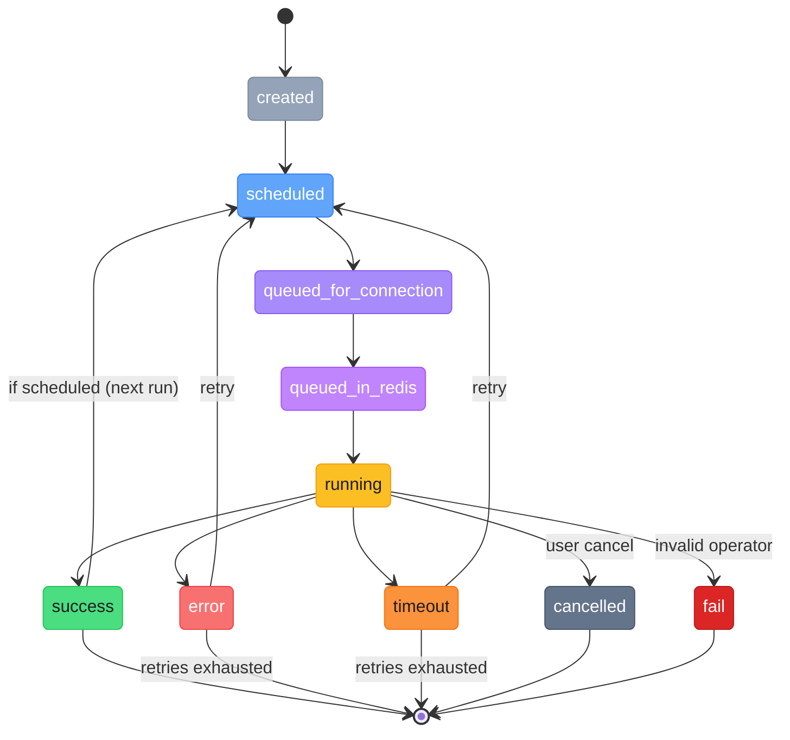

# Task States Reference

## State Enum

| State | Color | Description |
|-------|-------|-------------|
| `created` | `#94a3b8` (gray) | Task has been created but not yet scheduled |
| `scheduled` | `#60a5fa` (blue) | Task is scheduled and waiting for its logical_date |
| `queued_for_connection` | `#a78bfa` (violet) | Task is in the connection queue awaiting a slot |
| `queued_in_redis` | `#c084fc` (purple) | Task has been dispatched to the Celery broker |
| `running` | `#fbbf24` (amber) | Task is actively executing on a worker |
| `success` | `#4ade80` (green) | Task completed successfully |
| `error` | `#f87171` (red) | Task encountered an error during execution |
| `timeout` | `#fb923c` (orange) | Task exceeded its time limit |
| `cancelled` | `#64748b` (slate) | Task was cancelled by user via `user_set_state: cancel` |
| `fail` | `#dc2626` (dark red) | Task's operator is invalid or a fatal error occurred |

## State Transition Diagram

## State Transitions in Detail

### Happy Path
1. **scheduled** -> **queued_for_connection**: Task's logical_date has arrived, picked up by cron or API trigger
2. **queued_for_connection** -> **queued_in_redis**: Connection has available parallelism, task dispatched to Celery
3. **queued_in_redis** -> **running**: Celery worker picks up the task
4. **running** -> **success**: Operator completes execution successfully

### On Success (Scheduled Tasks)
- `logical_date` is incremented to the next cron interval
- `retry_number` is reset to `0`
- `iteration` is incremented
- State returns to **scheduled** (ready for next cron pickup)

### Error / Timeout with Retry
- `retry_number` is incremented
- If `retry_number < total_retries`: task remains eligible for retry
- Retry is picked up when: `last_run_date + retry_interval (minutes)` has passed
- After all retries exhausted: task stays in **error** / **timeout**

### User Cancellation
- User sets `user_set_state: "cancel"`
- During the next heartbeat poll, the executor detects the cancel flag
- State transitions to **cancelled**

### Fail State
- Occurs when the operator is invalid (missing required methods: `run()`, `initialize()`, `check_completion()`, `finish()`)
- Also occurs on fatal errors at the orchestration level
- Tasks in **fail** state do not retry

## user_set_state

| Value | Effect |
|-------|--------|
| `cancel` | Signals the running task executor to stop at the next heartbeat poll |
| `null` | No user-requested state change |

## Cron Interaction

The cron scheduler queries for tasks ready to run using these criteria:
- `state` is `scheduled` or `success` (for next scheduled run)
- `deleted_at` is null
- `user_set_state` is null
- `logical_date` <= current UTC time
- `start_date` <= current time (if set)
- `end_date` >= current time (if set)
- Parent workflow is not paused (`folder_metadata.state` != paused)

For retry-eligible tasks:
- `state` is `error` or `timeout`
- `retry_number < total_retries`
- `last_run_date + retry_interval` <= current time
