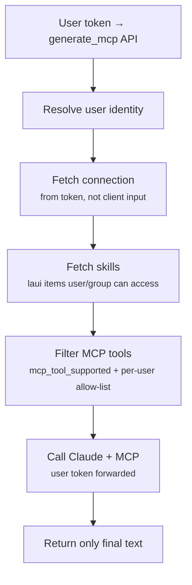

# LeastAction Service AI — Guide

This doc covers the AI built directly into the LeastAction service: how to configure it, how to generate operators, actions, and payloads using it, and how to build AI-powered operators and actions that call any AI provider you choose.

---

## How the Service AI Works

The service AI is the generation layer embedded in the UI — accessed from `AI > Operator`, `AI > Action`, and `AI > Payload`. It takes a natural language description and generates working code following LeastAction's contracts.

**Provider configuration — `chat`:** The AI provider powering generation is itself a LeastAction item of type `chat`. Like a regular action, it has a single `run` method that returns data — but it drives the generation service. You create a `chat` item in the catalog, point it at a connection that holds your API key and model, and the generation service uses it as the AI backend. No hard-coded provider, no config file to edit. The `chat` item is selected when you initiate a generation request (via `chat_laui`).

There is no lock-in. You control which provider powers generation, and the generated code itself can call whatever external APIs or AI services you want.

---

## Setting Up an AI Chat

To use AI-powered operators and actions (e.g. an action that calls Claude to generate a report, or an operator that calls GPT-4 to process data), create an AI chat in the catalog first.

**Example — Anthropic Claude AI chat:**
```json
{
  "api_key": "<your-anthropic-api-key>",
  "model": "claude-haiku-4-5-20251001",
  "token_limit": 10000
}
```

**Example — OpenAI AI chat:**
```json
{
  "api_key": "<your-openai-api-key>",
  "model": "gpt-4o",
  "max_tokens": 4096
}
```

**Example — Gemini AI chat:**
```json
{
  "api_key": "<your-gemini-api-key>",
  "model": "gemini-1.5-pro"
}
```

The `api_key` is stored on the connection and read by the chat as-is (placeholders are not expanded). Keep it out of source control and protect the connection with catalog permissions. The platform's own LLM key can instead come from the environment / AWS Secrets Manager (`USE_AWS_SECRETS`) — see [Configuration](/path?laui=getting-started-02-installation-02-configuration&itemtype=doc.file&itemname=Configuration). Once the AI chat is saved, any operator or action you generate can reference it.

---

## Generating Operators

Navigate to `AI > Operator` and describe what the operator should do. The generator follows the 4-method contract automatically.

**Example prompts:**
- *"Create an operator to query Athena and write results to S3"*
- *"Create an operator that calls the OpenAI API with a prompt from the payload and stores the response"*
- *"Create an operator to run a shell command on an EC2 instance via SSM and return the output"*

The AI generates:
- `initialize` — set up clients using the connection credentials
- `run` — execute the operation, return `execution_type` (`sync`/`async`) and result
- `check_completion` — poll for completion (async ops) or pass through (sync ops)
- `finish` — clean up resources

Plus a `bashblock` for dependencies and sample connection / payload JSON.

See [Operator Guide](/path?laui=getting-started-04-concepts-03-operator&itemtype=doc.file&itemname=Operator) for the full method contract and examples.

---

## Generating Actions

Navigate to `AI > Action` and describe the action's purpose. The generator produces a single `run(least_action_action_object, ...)` method that returns `True` or `False`.

**Example prompts:**
- *"Create an action that sends a Slack notification with the task name and status"*
- *"Create an action that calls Claude to analyze the task's error log and return a suggested fix"*
- *"Create an action that checks a PostgreSQL table for a row matching today's date and returns True if found"*
- *"Create an action that cancels all downstream tasks if this task produces no output rows"*

The action receives the full task context via `least_action_action_object`:
- `action_variables` — parameters you configure per task
- `connection` — credentials for external services
- `task` — the full task object (name, state, frequency, last_run_date, etc.)
- `session_id`, `laui`, `sla`, `task_result`

See [Action Guide](/path?laui=getting-started-04-concepts-06-action&itemtype=doc.file&itemname=Action%20Aka%20Hook) for lifecycle types, configuration, and the full list of built-in actions.

---

## Generating Payloads

Navigate to `AI > Payload`, select an operator, and describe what the task should do. The generator reads the operator's expected payload format and produces a compatible payload with placeholders for values you need to fill in.

**Example:** Select `PostgresqlExecuteSQL`, describe *"insert today's rows into the `people` table"* — the AI generates the SQL with `{{logical_date}}` for the date.

Payloads can be any format the operator expects: JSON, SQL, Python, plain string. See [Payload Guide](/path?laui=getting-started-04-concepts-04-payload&itemtype=doc.file&itemname=Payload).

---

## Building AI-Powered Operators and Actions

This is where the no-lock-in design matters. You are not limited to using only LeastAction's built-in AI chat — you can generate operators and actions that call any AI provider using any credentials you supply.

**Example: Action that uses Claude to generate a SQL query from natural language**

1. Create an `Anthropic` AI chat in the catalog with your API key and model
2. Navigate to `AI > Action`, describe: *"Create an action that takes a user question from action_variables, fetches the database schema from a PostgreSQL connection, sends both to Claude API to generate a SQL query, runs it, and saves the result as an HTML report to the catalog"*
3. The generator produces working Python code that:
   - Calls `anthropic.Anthropic(api_key=connection['api_key'])`
   - Constructs the prompt with schema + question
   - Executes the generated SQL
   - Saves the output as an `html_report` catalog item

The action uses the AI chat you supply at runtime — swap the AI chat to switch models or providers without touching the code.

**Example: Operator that processes data with OpenAI**

Describe: *"Create an operator that reads a batch of records from the payload, sends each to OpenAI with a classification prompt, and returns the labeled results"*

The generated operator uses `openai.OpenAI(api_key=connection['api_key'])` — your OpenAI AI chat provides the credentials.

---

## Skills During Generation

When generating, you can attach **skills** — catalog items (`item_type: "skill"`) that inject additional context into the generation prompt. Skills can contain:

- Your internal coding conventions
- Schema descriptions or table definitions
- Generation rules specific to your operators
- Examples of patterns you want the AI to follow

The AI reads the skill content and follows it when writing code. This is how you ensure generated code matches your team's standards without rewriting prompts every time.

**How to attach:** In the AI generation UI, select one or more skills before generating. The skill content is prepended to the system prompt.

---

## Session Management

Generation sessions are stateful. Each session maintains the conversation history — you can refine the generated code, ask for changes, and iterate without starting over.

**Resuming sessions:** Navigate to your user page to see all previous AI sessions. Click any session to resume it with full context intact.

This is useful when:
- You generate an operator, test it, and come back the next day to fix an edge case
- You want to generate a family of related operators in one coherent session
- A generation produces something close but not quite right and you want to refine it

---

## Service Chat UI

The service includes a built-in chat interface — not just a code generator, but a conversational AI you can talk to directly from the UI.

**How to use it:**
1. Navigate to the chat widget in the UI
2. Select an `agent` item from the catalog (your conversational agent)
3. Select a `connection` (your AI provider credentials)
4. Start chatting — or resume a previous session from the history dropdown
5. Optionally search and attach **skills** from the skill selector below the message input — selected skill content is prepended to the system prompt for each message

**What is an `agent` item?**

An `agent` is a catalog item type that defines the conversational AI logic backing the chat endpoint. It exposes a `run(connection, messages, tools=None)` function — it receives conversation history, optionally binds MCP tools, and returns `{"content": "...", "tool_calls": [...]}`. Because it's just code, you can use LangGraph, a simple API call, a multi-step chain, or any framework your team prefers. No lock-in to a specific AI pattern.

You generate `agent` items in the wizard under `AI > AI Agent`, or create them manually in the catalog. The `chat` item type is separate — it powers the generation wizard, not the chat widget.

**`chat` vs `agent` — at a glance:**

| | `chat` | `agent` |
|---|---|---|
| Used by | Generation wizard (`AI > Operator` etc.) | Chat widget |
| Function signature | `run(connection, messages)` | `run(connection, messages, tools=None)` |
| Output | Structured JSON via `with_structured_output` | `{"content": str, "tool_calls": [...]}` |
| MCP tools | No | Yes (optional) |

**Security model:**

The chat endpoint enforces identity at every call:



The connection is resolved server-side from the user's token — the client never supplies credentials directly. Skills and MCP tools are filtered to only what the user's token has access to. The AI cannot act outside that boundary.

**Per-user MCP tool restrictions** apply here too. If an admin has disabled `delete_item` for a user, the AI chat cannot call it either — the restriction is enforced at the MCP layer, not at the chat layer. See [mcp.md](mcp.md) for how admins manage tool access per user.

---

## No Lock-In

LeastAction does not require you to use any specific AI provider. The generation service is powered by a `chat` item you create and save in the catalog — point it at any provider you want. The operators and actions it generates can call any external API, AI or otherwise. Credentials live in catalog connections, separate from code.

If you want to replace Claude with GPT-4 in an AI-powered action, update the AI chat. The action code does not change.
