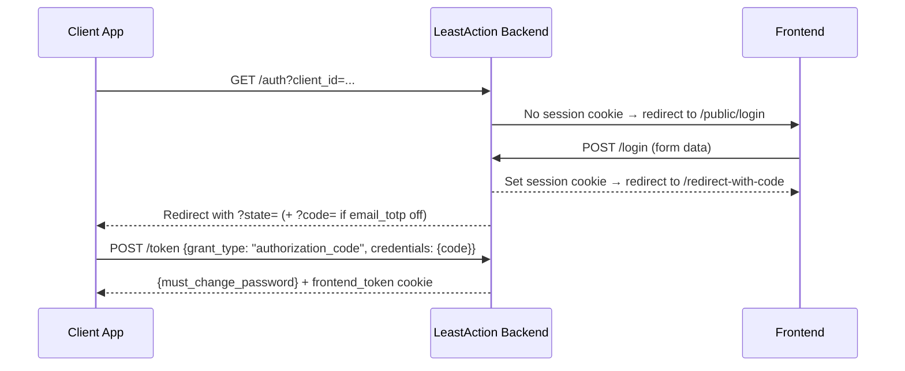

# Authentication API

All authentication endpoints are public (no Bearer token required).

## OAuth Flow Overview



---

## POST `/api/v1/login`

Authenticate a user with username/password and redirect with a session cookie.

**Authentication**: None  
**Content-Type**: `application/x-www-form-urlencoded`

### Form Fields

| Field | Type | Required | Description |
|-------|------|----------|-------------|
| `username` | string | Yes | Username |
| `password` | string | Yes | Password (URL-encoded) |

### Request Example

```
POST /api/v1/login
Content-Type: application/x-www-form-urlencoded

username=john_doe&password=securePassword123
```

### Success Response

**Status**: 303 See Other

Redirects to `/api/v1/redirect-with-code?user_laui=<laui>` with a `session` cookie set containing encoded user data.

### Error Responses

**401 Unauthorized** — Invalid credentials
```json
{"detail": "Invalid username or password"}
```

---

## GET `/api/v1/auth`

Initiate the OAuth authorization flow. Sets `oauth_flow` cookie with client details.

**Authentication**: None

### Query Parameters

| Parameter | Type | Required | Description |
|-----------|------|----------|-------------|
| `client_id` | string | Yes | OAuth client identifier |
| `redirect_uri` | string | Yes | Client callback URL |
| `state` | string | Yes | State parameter for CSRF protection |

### Request Example

```
GET /api/v1/auth?client_id=my-app&redirect_uri=/callback&state=abc123
```

### Success Response

**Status**: 303 See Other

- **With existing session cookie**: Redirects to `/api/v1/redirect-with-code?user_laui=<laui>`
- **Without session cookie**: Redirects to `/public/login` (frontend login page)

Both set the `oauth_flow` cookie with encoded `{client_id, redirect_uri, state}`.

---

## GET `/api/v1/redirect-with-code`

Exchange a user session for an authorization code and redirect to the client.

**Authentication**: None (requires `oauth_flow` cookie)

### Query Parameters

| Parameter | Type | Required | Description |
|-----------|------|----------|-------------|
| `user_laui` | string | Yes | User's LAUI |

### Request Example

```
GET /api/v1/redirect-with-code?user_laui=507f1f77bcf86cd799439011
```

### Success Response

**Status**: 303 See Other

Redirects to `{redirect_uri}?state=<original_state>` using the `redirect_uri` and `state` from the `oauth_flow` cookie.

- **When `email_totp` is disabled** (default): `?code=<random_hex>&state=<original_state>` — code is included directly.
- **When `email_totp` is enabled**: `?state=<original_state>` only — code is sent to user's email instead.

### Error Responses

**403 Forbidden** — Missing `oauth_flow` cookie

Returns 403 with empty body.

---

## GET `/api/v1/check_frontend_token_present`

Check whether the `frontend_token` cookie is present.

**Authentication**: None (requires `frontend_token` cookie)

### Request Example

```
GET /api/v1/check_frontend_token_present
```

### Success Response

**Status**: 200 OK

Empty response body.

### Error Responses

**422 Unprocessable Entity** — Cookie not present
```json
{
  "detail": [
    {
      "type": "missing",
      "loc": ["cookie", "frontend_token"],
      "msg": "Field required"
    }
  ]
}
```

---

## POST `/api/v1/token`

Exchange credentials for an access token. Sets `frontend_token` cookie on success.

**Authentication**: None

### Request Body

| Field | Type | Required | Description |
|-------|------|----------|-------------|
| `grant_type` | string | Yes | `"authorization_code"` or `"refresh_token"` |
| `credentials` | object | Yes | Credential details (varies by grant type) |

### Variation 1: Authorization Code Grant

```json
{
  "grant_type": "authorization_code",
  "credentials": {
    "code": "a1b2c3d4e5f6",
    "provider": "least_action"
  }
}
```

### Variation 2: Refresh Token Grant

```json
{
  "grant_type": "refresh_token",
  "credentials": {
    "token_string": "a3f8e2b1c9d4..."
  }
}
```

> `token_string` is a 64-character hex string, not a JWT.

### Success Response

**Status**: 200 OK

Sets the `frontend_token` cookie (JWT access token, RS256-signed, 24h expiry).

```json
{
  "must_change_password": false
}
```

### Error Responses

**400 Bad Request** — Mismatched grant_type and credentials
```json
{"detail": "if grant type is refresh_token: then token_string must be passed in credentials."}
```

**401 Unauthorized** — Invalid authorization code or refresh token
```json
{"detail": "Invalid authorization code"}
```

---

## GET `/api/v1/get-mcp-token`

Return the current access token from the `frontend_token` cookie. Used by MCP clients to retrieve a machine-usable token.

**Authentication**: Requires `frontend_token` cookie (set by `/token`)

### Request Example

```
GET /api/v1/get-mcp-token
```

### Success Response

**Status**: 200 OK

```json
{
  "access_token": "<JWT from frontend_token cookie>"
}
```

### Error Responses

**401 Unauthorized** — Cookie missing or token invalid
```json
{"detail": "Unauthorized"}
```

```json
{"detail": "Invalid token"}
```

---

## POST `/api/v1/logout`

Log out the current user by clearing all session cookies.

**Authentication**: None

### Request Example

```
POST /api/v1/logout
```

No request body required.

### Success Response

**Status**: 200 OK

```json
"logged out"
```

Deletes cookies: `frontend_token`, `oauth_flow`, `session`.

---

## Cookie Reference

| Cookie | Set By | Purpose |
|--------|--------|---------|
| `session` | `POST /login` | Encoded user data for server-side session |
| `oauth_flow` | `GET /auth` | Encoded OAuth parameters (client_id, redirect_uri, state) |
| `frontend_token` | `POST /token` | JWT access token (RS256, 24h). Used by auth middleware to identify the current user. |
