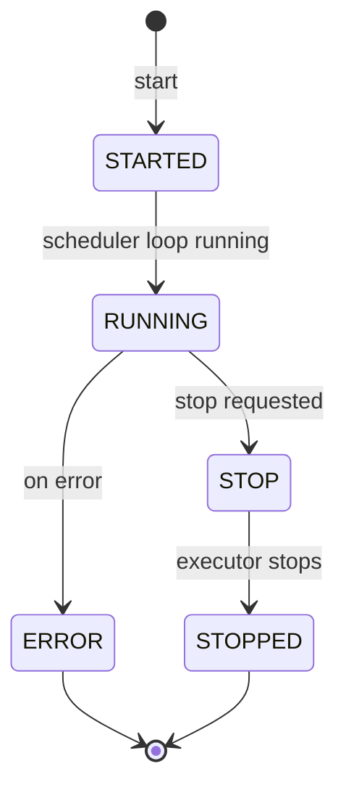

# Cron API

**Prefix**: `/api/v1/cron`
**Authentication**: Required (Bearer token)

---

## POST `/api/v1/cron/manage`

Start or stop the cron scheduler for a project. The cron scheduler periodically discovers tasks ready to run and dispatches them.

**Access Control**: OWN permission on `project_laui`

### Request Body

| Field | Type | Required | Description |
|-------|------|----------|-------------|
| `project_laui` | ObjectId | Yes | Project to manage cron for |
| `action` | enum | Yes | `"START"` or `"STOP"` |

Note: This model uses `extra="forbid"` — no additional fields allowed.

---

### Variation 1: Start Cron

```json
{
  "project_laui": "507f1f77bcf86cd799439011",
  "action": "START"
}
```

### Variation 2: Stop Cron

```json
{
  "project_laui": "507f1f77bcf86cd799439011",
  "action": "STOP"
}
```

---

### Success Response — Start

**Status**: 200 OK

```json
{
  "success": true,
  "message": "Cron started successfully for project 507f1f77bcf86cd799439011",
  "project_laui": "507f1f77bcf86cd799439011",
  "action": "START"
}
```

### Success Response — Stop

**Status**: 200 OK

```json
{
  "success": true,
  "message": "Cron stopped successfully for project 507f1f77bcf86cd799439011",
  "project_laui": "507f1f77bcf86cd799439011",
  "action": "STOP"
}
```

### Error Responses

**400 Bad Request** — Invalid action
```json
{"detail": "Invalid action: RESTART"}
```

**403 Forbidden** — No OWN access on project
```json
{"detail": "Access denied"}
```

**404 Not Found** — Project not found
```json
{"detail": "Item not found"}
```

**409 Conflict** — Cron already running (for START)
```json
{"detail": "Cron is already running for this project"}
```

**422 Unprocessable Entity** — Validation error
```json
{
  "detail": [
    {
      "type": "value_error",
      "loc": ["body", "action"],
      "msg": "Input should be 'START' or 'STOP'"
    }
  ]
}
```

**500 Internal Server Error**
```json
{"detail": "Internal server error: <message>"}
```

---

## Cron Status Lifecycle



| Status | Description |
|--------|-------------|
| `STARTED` | Cron job initialized, Celery task dispatched |
| `RUNNING` | Scheduler loop is actively polling for tasks |
| `STOP` | Stop signal sent, waiting for executor to finish |
| `STOPPED` | Executor has fully stopped |
| `ERROR` | Scheduler encountered an unrecoverable error |

## Cron Behavior

### Health Monitoring
- The cron scheduler updates a `latest_heartbeat` timestamp on the project's `folder_metadata`
- If the heartbeat becomes stale (exceeds `3 * interval_seconds`), the system considers the cron dead
- On detecting a stale heartbeat, a new cron is automatically restarted

### Configurable Intervals
- Default interval: `project_scheduler_interval` from `config/system.yml` (default: 5 seconds)
- Per-project override: `{project_name}_cron_interval` in system config

### Project Folder Metadata

When cron is running, the project folder's `folder_metadata` is updated:

```json
{
  "cron_status": "RUNNING",
  "latest_heartbeat": "2024-01-15T10:30:00Z",
  "start_date": "2024-01-15T10:00:00Z",
  "stop_date": null,
  "error": null
}
```

### Task Discovery

Each cron cycle:
1. Queries for scheduled tasks where `next_run_date <= now` (and `next_run_date <= end_date`)
2. Queries for retry-eligible tasks where `last_run_date + retry_interval <= now`
3. Filters out tasks in paused workflows
4. Dispatches eligible tasks through the execution pipeline
